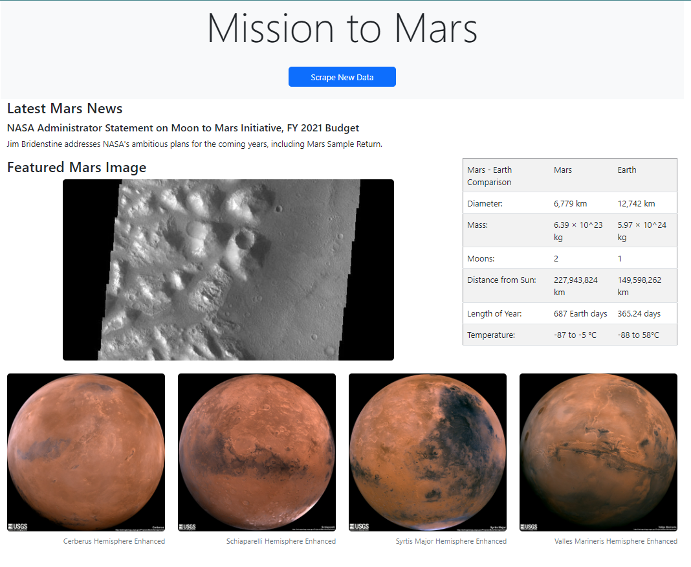

# web-scraping-challenge

### Goal
The goal of this assignment was to create a dynamic Flask website that displays data scraped from the a variety of other websites. To pull this off, we were to create the script with a Jupyter Notebook then port this script to a Python function. This function would be used to scrape the data and relay it to the Flask application.

### Execution
This task required steps to extract data from websites, transform them into usable formats, then load them into a MongoDB database. Once in the database, the Flask application is able to pull data from the database and display it dynamically with Jinja2. A clause had to be added for the first run because the database is empty at that point. This clause uses junk data as placeholders for the scraped data. If the Flask app shows this junk data, using the 'Scrape New Data' button will retrieve new data, populate the database with it, then relay the data to the Flask app.

### Flask App Static Preview

